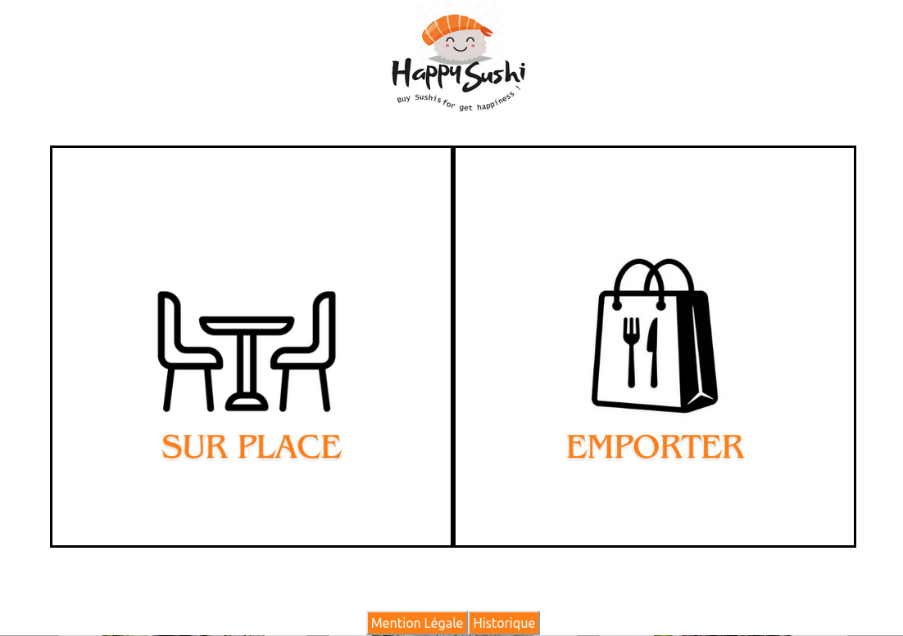
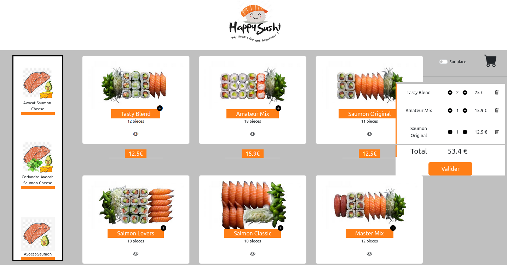
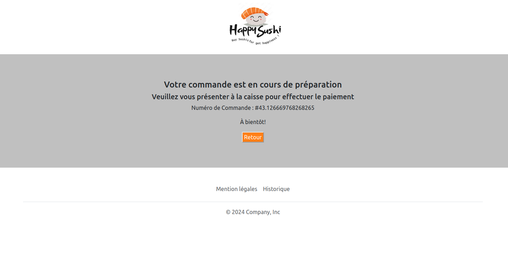
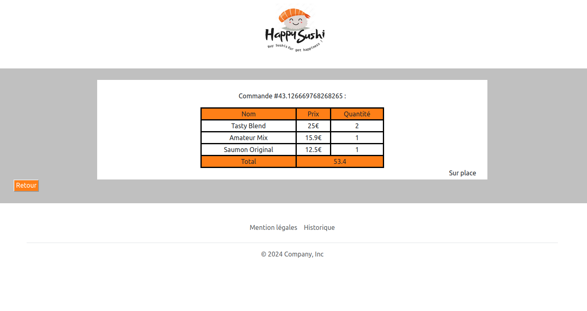
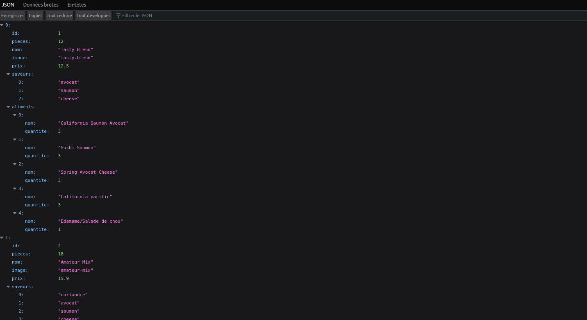
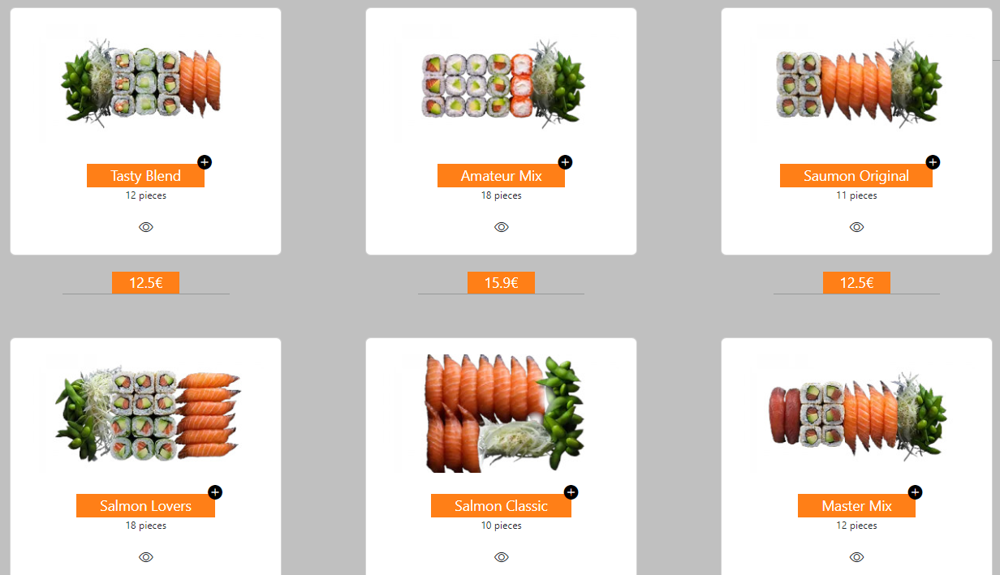

= Compte Rendu : Sushi App
:toc-title: Tables des matières
:toc: top
Projet réalisé par : *Devamadushan* +
Du 11/03/2024 au 7/04/2023 +
== Contexte
----
Dans le cadre de notre projet Sushi App, notre objectif était d'apprendre à utiliser le framework Angular, d'explorer et de développer des compétences en programmation TypeScript(Front end), et de stimuler notre créativité.
----
== Introduction
----
Après avoir identifié les objectifs de ce projet, nous examinerons la création de Services, de Modèles, de composants, de classes et de méthodes. Nous aborderons également les difficultés rencontrées avant de conclure.
----
Le projet consistait à créer une borne de commande pour un restaurant de sushi, permettant aux clients de choisir leur boîte désirée et de valider leur commande.

== Etape 1 : API
=== a).Configuration de l'API
----
Tout d'abord, nous avons diffusé une API fournie par nos enseignants en local, à l'aide d'IntelliJ.
----

=== b).Configuration Angular pour l'API
----
deuxiemement nous avont cree un projet angular et un serviceBOx et u environnement pour aller cherc her le API qui est present en Localhost.
----
----
Deuxièmement, nous avons créé un projet Angular ainsi qu'un service Box et un environnement pour récupérer l'API présente en local.
----
#environment.ts#
----
L'environnement contient le lien où l'on peut retrouver les APIs Sushi, dans l'attribut apiBaseUrl.
----
[source,typescript]
----
export const environment = {
    production: true,
    apiBaseUrl: 'http://localhost:8080/api/boxes',
};
----

#boxService.ts#
----
Le service Box permet de récupérer les APIs à l'aide de l'URL présent dans l'environnement.
----

[source,typescript]
----
export class BoxsService {

  constructor(private http:HttpClient) {

  }
// Récupère les API avec l'URL indiquée dans l'environnement.
  public getBoxs(): Observable<any>{
    //console.log(this.http.get(environment.apiBaseUrl))
    return this.http.get(environment.apiBaseUrl)
  }

// Retourne la boîte présente dans une liste de boîtes en comparant un idBox récupéré en paramètre.
  getBoxsById(lesBoxs:Array<Box>,idBox: number) {
   return lesBoxs.find((uneBox:Box)=>uneBox.id==idBox)

  }

}
----
NOTE: HttpClient est une classe qui permet d'utiliser les méthodes HTTP (GET, POST, PUT, DELETE...).

== Etap 2: Utilisation des API
=== a).Création du composant
----
Une fois que nous avons récupéré les APIs nécessaires, je crée un composant Home dans lequel je vais tenter d'afficher toutes les boîtes de sushi collectées.
----
#home.component.ts#
[source, typescript]
----
//Tous les boîtes récupérées par l'API.
boxes:Array<Box>=[]

// Une liste des boxes triées par les saveurs
listBoxBySaveurs:Map<string,Array<Box>> = new Map<string,Array<Box>>()

// Toutes les boxes choisies par l'utilisateur
panier:Array<Ligne>

  constructor(private boxs : BoxsService,private panierService:PanierService){
    // Récupère toutes les boxes choisies par l'utilisateur dans le panierService
  this.panier = this.panierService.getAllBoxes()

// Récupère toutes les boxes depuis l'API et crée des objets BOXES
    this.boxs.getBoxs().subscribe((resultat)=>{
      for (const uneBox of resultat) {
        let box1=Box.transforme(uneBox)
        this.boxes.push(box1)
      }

      // Trie toutes les boîtes avec leurs saveurs
      this.boxesBySaveur()
    })

    panierService.onMajPanier.subscribe(()=>{
      this.panier=[]
      this.panier = this.panierService.getAllBoxes()
    })
  }
----

NOTE: J'utilise la méthode *subscribe()* pour observer les résultats d'une opération asynchrone. Elle permet d'exécuter du code en réponse à ces résultats.

=== b).Affichage des boxes de sushi
----
Une fois que j'ai terminé le développement côté backend, je passe au frontend pour afficher les boxes.
----
[source, html]
----

 
<button class="button-box" (click)="addPanier(box)">{{ box.nom }} <i class="bi bi-plus-circle-fill"style="position: absolute;margin-left: 6%;margin-top: -5%;color:black"></i></button>

{{ box.pieces }} pieces

<i class="bi bi-eye"  [routerLink]="'detail/' + box.id" style="cursor: pointer;"></i>

  {{ box.prix }}€

----
----
J'utilise une boucle for-of pour parcourir un par un les attributs de la variable "boxes" et j'essaie d'afficher le nom, le prix et l'image de chaque boîte.
----

== Conclusion
Le projet m'a aidé à développer mes connaissances en TypeScript, le framework Angular, et ma créativité. Cependant, il a été plus difficile comparé à d'autres projets car nous étions plus autonomes que d'habitude et sans guide. De plus, reproduire exactement la maquette (notamment le menu déroulant)a été difficile au niveau du front-end. Enfin, j'ai ressenti une grande satisfaction à la fin du projet en parvenant à reproduire fidèlement ce que j'avais réalisé sur la maquette.
